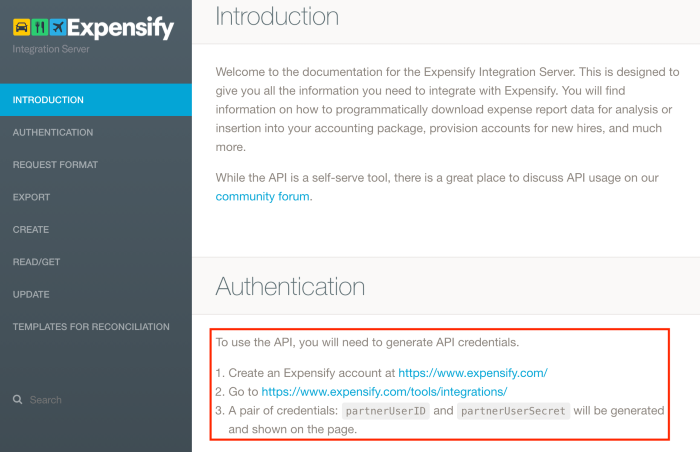
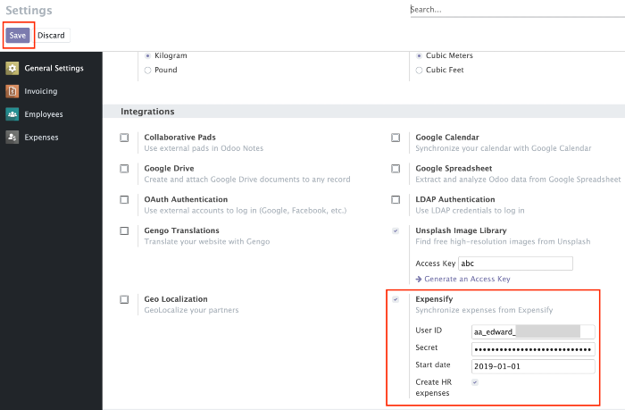
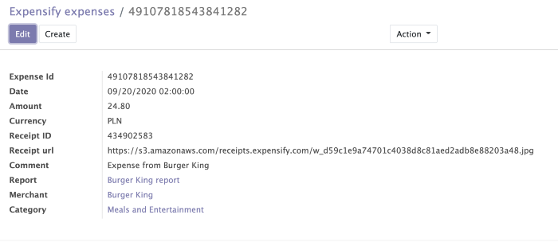
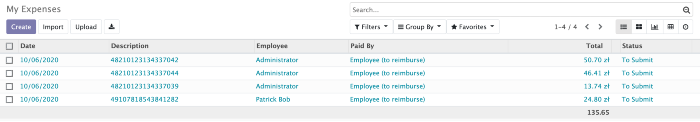
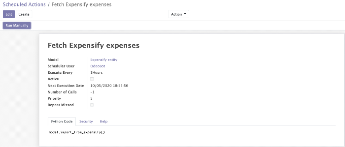

## Expensify connector

Expensify connector allows to import expenses from Expensify account directly to Odoo.

Important: this module depends on Python libraries: json,requests,csv.

1.Generate API token.

2.Install module.

3.In General settings provide API credentials and start date for which expenses will be included in the generated report and click "Save".

Additionally, you can enable the flag: "Create HR expenses". This flag allows automatically creating HR expenses in Odoo, based on imported expenses from Expensify.

4.After installing the module in the Expenses menu will appear the menu "Expensify".

5.You can import expenses by clicking on "Fetch expenses" in the Expensify menu.

If in General settings "Create HR expenses" flag was enabled, HR expenses will be automatically created as well.

Alternatively you can enable "Expensify" scheduled action, which will import expenses automatically based on time interval (for example, every hour).

By default module creates: expensify product and expensify employee.

Expensify expense doesn't contain product but Odoo HR expense model requires to specify product.

Expensify employee is used in case if employeeEmail from expensify doesn't match any existing employee in Odoo based on work_email field.

